# Rail safety worker identity card extension for CiviCRM (au.org.prr.rswidcard)

This extension enables the generation of rail safety worker identity cards. 
The process is similar to creating mailing labels. The output is a PDF file.
An ID card includes a contact's photo and a QR code that contains a URL that links to a web page that displays
rail safety approvals, assessments, training and health data.

Although it was developed specifically for use in battling the Australian rail safety red tape, it could be adapted to other purposes such as membership cards.

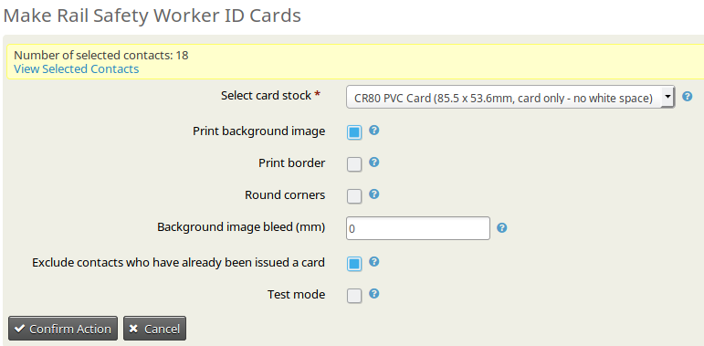

During installation a number of Mailing Label Formats (which are used as card formats) and Paper Sizes will be defined.

The extension is licensed under [AGPL-3.0](LICENSE.txt).

## Requirements

* PHP v5.6+
* CiviCRM 4.7+ (tested on 4.7.30 and 5.0.0)

## Installation

This extension has not yet been published for installation via the web UI or in a public git repo.

Extract the .zip file into the CiviCRM extensions directory and install via CiviCRM's web UI.

### Rail safety worker data standalone web page
This is a stand-alone web page (but it is included in this extension) the retrieves data from CiviCRM's database. 
The URL to it is embedded in the QR code on the ID cards. As the ext directory may not be directly accessible, 
and also to permit shorter URLs to minimise the data in the QR code, move `rsw/index.php`
to a directory `rsw` under the web root.

Edit `index.php` with the location of the extension (actually this file is only this one line):
```php
require_once '../membership/media/civicrm/ext/au.org.prr.rswidcard/extern/rswdata.php';
```
And edit the path in `extern/rswdata.php` to `civicrm.config.php`:
```php
// Perform bootstrap of CiviCRM
// Edit the below line with the correct path to CiviCRM
require_once '../membership/administrator/components/com_civicrm/civicrm/civicrm.config.php';
```

### Configuration
This extension has a configuration form at **Administer > ID Card settings**. This goes some way to allowing the cards' appearance to be customised to suit other organisations.
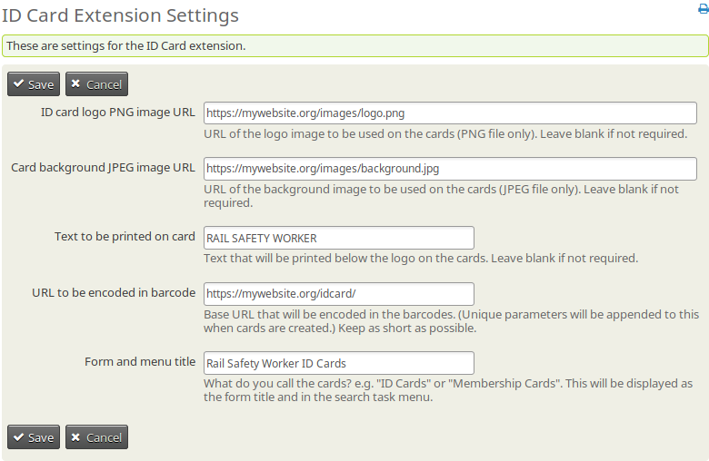

## Usage

In CiviCRM, individuals, households and organisations are all called *Contacts*. (Only individuals are relevant to this extension.)

In other words, all rail safety workers will be referred to as *Contacts* in this document.

### Upload photos

The layout of the identity cards was designed to accommodate a photo of 3:4 aspect ratio (portrait orientation). The recommended size is 600 pixels wide by 800 pixels high.

> **Note:** If photos do not conform to this aspect ratio they will be automatically cropped and centred at the time the PDF is created. This is unlikely to be optimal.

The CiviCRM-standard "Contact Image" will be used for the photo on the ID card.

To add a photo to a contact:
* Navigate to the contact for whom you would like to add a photo by searching or any other means

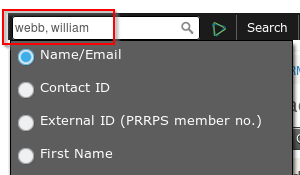

* Click on the Edit button below the contact's name
* On the Edit Contact page click the **Browse** button in the **Contact Details** section under **Browse/Upload Image** and select the photo file in your web browser
* Click the **Save** button

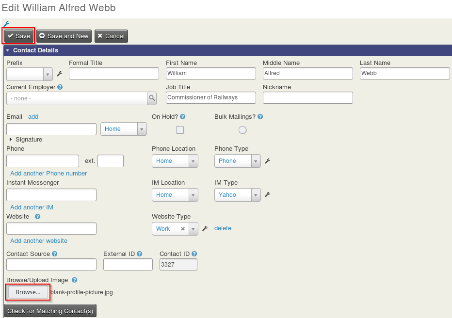

> **Note:** Please reduce the size of the photo files to no more than 200kB before uploading. This helps wasting disk space on the web server and minimises the size of
the PDF files that you will download from this extension.

### Creating ID cards

Because ID cards will usually be printed with multiple cards per sheet, the extension needs to be given a selection of contacts to create the cards for.

* Either perform a search (**Search > Find Contacts** or **Search > Advanced Search**) or use a pre-defined group (**Contacts > Manage Groups**, then click on the 
**Contacts** link in the correct group's row) to bring up the contacts that require ID cards. This is the same process that is used for creating normal mailing labels.
If a group has not already been set up then do that first.

> **Note:** When doing a Quick Search, CiviCRM (with its default settings) requires you to enter **Surname, Given Name** and press 
**Enter** to search for a specific contact. You can also use just the surname.

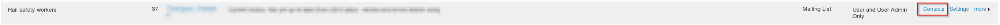

* Select all contacts (**Select Records: All xx Records**) or if you require a subset of the group or search results then use the checkbox next to each
name to select the contacts that you need
* In the Actions drop-down, select **Rail safety worker ID cards - Print**

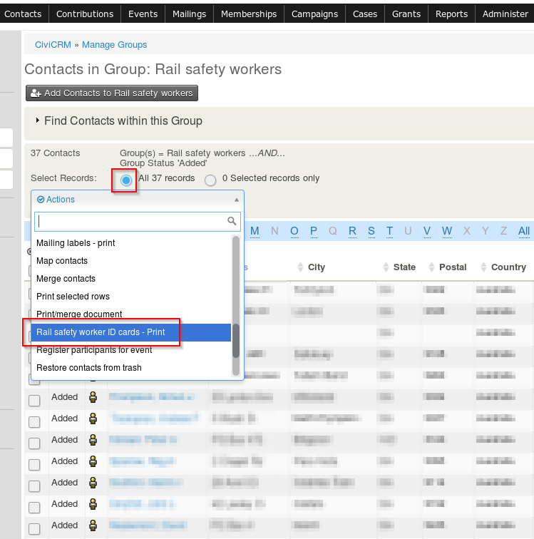
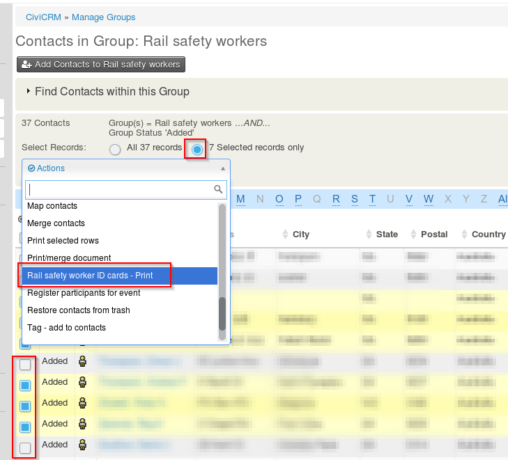

> **Note:** it is not possible to create an ID card from the Actions menu on the Contact Summary page.

A form will then be displayed with options for creating the identity cards.

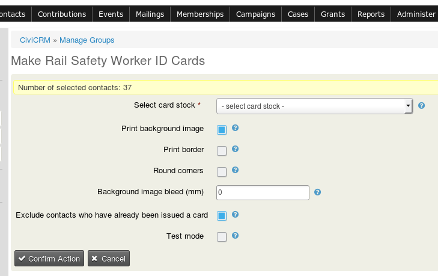

Option | Description
--- | ---
**Select card stock** | The Rail Safety Worker ID Card extension has been designed to print on several types of proprietary cards: Avery card sheets and Brainstorm ID inkjet-printable PVC cards and Teslin paper. Select one from the drop-down list. If you are printing to plain card or paper then select one of the Avery A4 types e.g. C32011. You may wish to enable <b>Print borders</b> if using plain card/paper. Currently the following card stocks have been defined:<br /> 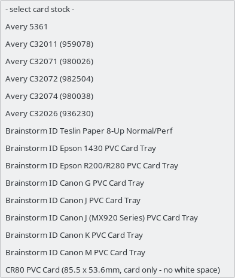
**Print background image** | This option, which is selected by default, selects whether or not the pre-defined background image will be included on the ID cards. This image cannot be changed.
**Print border** | Enable this option if you will be printing on plain paper or card and need borders printed as an aid in the manual cutting of the cards. If you are using proprietary cards do not enable this option.
**Round corners** | Round the corners of the cards i.e. round the corners of the background image and border if selected. This option is only useful if the cards will be printed on plain paper or card.
**Background image bleed (mm)** | When printing to Avery or Brainstorm cards, slight misalignments could cause white edges on the cards. To avoid this you can specify a "bleed" in millimetres. The background image will be printed larger than the card area so that it bleeds over the card edges. For example specifying a bleed of 1 mm will print the background image oversize so that it bleeds 1 mm in all directions (left, top, right and bottom). Do not use this option if you will be manually cutting the cards.
**Exclude contacts who have already been issued a card** | This option is selected by default as a precaution. As only the latest ID card details for each worker are stored in the database, generating another ID card would mean that the existing ID card's QR code would no longer work. When this option is selected no card will be created for contacts with card details recorded in the database already, even though they were in the list of selected contacts. If all contacts have an ID card already then the PDF will be blank. If you are issuing replacement cards then unselect this option.
**Test mode** | Use this option when testing PDF creation and printing only. If selected, nothing will be written to the database. QR codes will not work. An activity will not be recorded.

> **Warning:** Unselecting **Exclude contacts who have already been issued a card** will mean that the records of previous cards for the selected contacts will be overwritten. The QR codes of the previous cards will stop working, which means that the new cards
will have to be physically issued to the workers. Take care not to unselect this option accidentally.

After setting the options click the **Confirm Action** button. The server will create a PDF file and a prompt will appear in your browser. Save the PDF file to a location on your computer and then open it in a PDF viewer.

> **Note:** Ensure that you print the PDF at actual size or 100%.

The below example is from Adobe Reader DC on Windows:

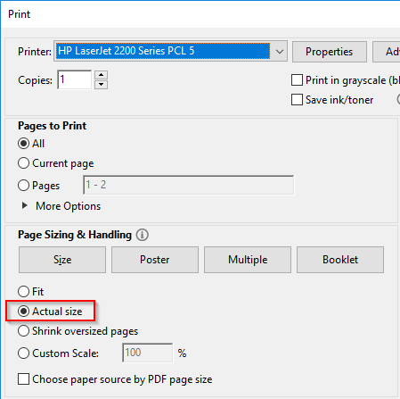

<!-- #### Creating blank ID cards (for temporary issue)

Due to the logistical problems of creating cards on-site, this feature was requested to permit a sheet of 'blank' cards to be created which would be 
filled in by hand by a supervisor.

The conditions under which these temporary cards are permitted to be used have not yet been defined by PRRPS.

1. In the main CiviCRM navigation menu select **PRRPS > Make blank temporary RSW ID cards**
2. Select options such as card stock as above

> **Note:** as no data can be written to the database for blank cards the **Exclude contacts who have already been issued a card** and **Test mode** 
options have no effect.

> **Warning:** Issuing a temporary identity card in no way relieves the organisation of its obligation to meet the legislated requirements 
for rail safety worker competence and health assessment.-->

### Auditing card issue

To verify that an identity card was created there are two methods available:
* As an Activity is created whenever an ID card is created, the Activity can be located and viewed to verify card creation.
* The card issue date is stored in a custom field group, which is visible on the Contact Summary page. The presence of a date in this field verifies 
that an ID card was created; the field will be empty otherwise.

> ** Important:** Do **not** upload the generated identity card PDF files to the server. The above methods provide sufficient means of auditing card issue so the cards themselves do
not need to be stored in CiviCRM (or anywhere else). Doing so would be a waste of time and disk space. Importantly, it would be a security risk 
as the cards contain a key that is effectively a password. It is **never** permissable to store unencrypted passwords of any kind.

## Using the QR code to display rail safety worker data

The QR code on the identity card contains an embedded URL (link) to a web page that displays the contact's rail safety records. This URL contains a secret key to prevent 
unauthorised access to records.

Many smartphones' native camera apps automatically decode QR codes. Third-party QR code apps are also available. The only requirement is that the app 
allows the URL to be opened in the phone's web browser.

When this web page is opened complete the reCAPTCHA and click **Submit**.

The next page is divided into four sections. Tap on a heading to expand it.

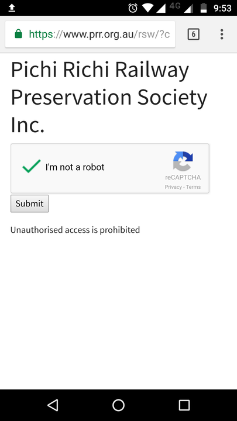
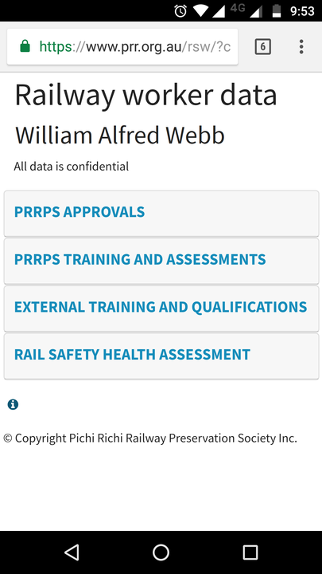

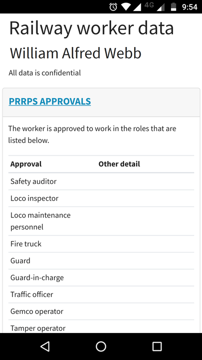
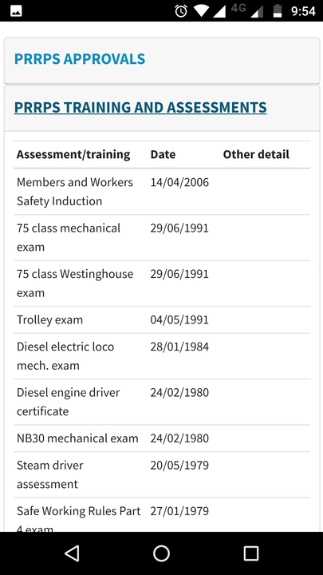

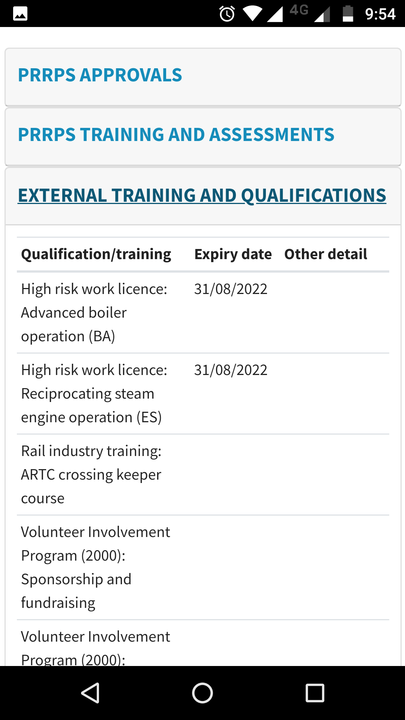
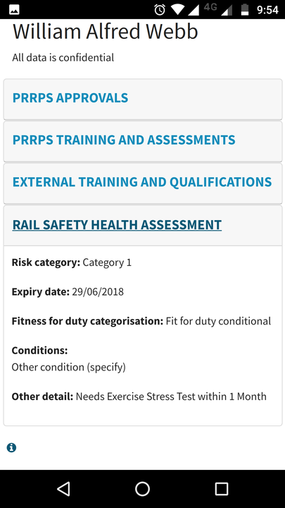

Clicking the icon near the bottom opens a help page.

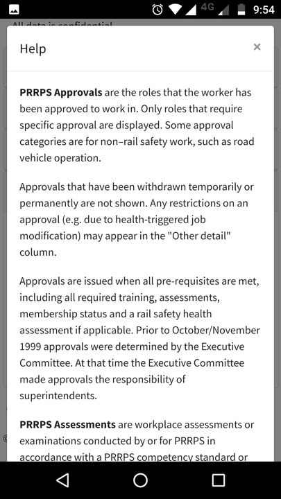
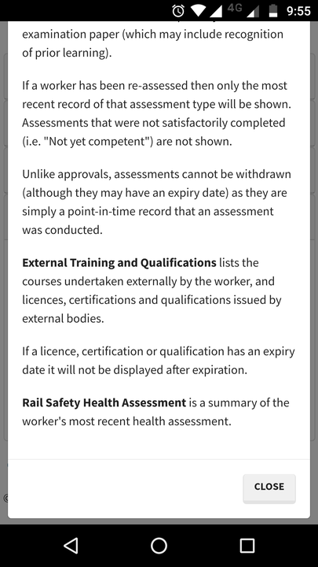

> **Note:** Inductions appear under *PRRPS Training and Assessments*

> **Warning:** To avoid exposing confidential health assessment detail on this web page, avoid recording sensitive information in the 
**Other detail** field. Use the **Other detail (private)** field when entering Rail Safety Health Assessment records, which is not displayed on this page.

## Frequently asked questions

### What are Brainstorm ID cards?

[Brainstorm ID Supply](http://www.brainstormidsupply.com) sells several types of printable ID cards. The company is based in the USA.
* [Teslin paper](https://brainstormidsupply.com/teslin-ids)
* [Inkjet-printable PVC cards](https://brainstormidsupply.com/inkjet-id-cards)

> **Note** The inkjet-printable PVC cards require specfic models of inkjet printers. The printer must support printing on CDs as the Brainstorm card tray is used in place of the original CD tray.

### How can I print on plain sheets of A4 or Letter size card or paper?

Just use one of the Avery Cxxxxx formats for A4 size, or the Brainstorm Teslin format for Letter size.

### Can I get cards printed by a company offering a card printing service?

Yes. The **CR80 PVC Card (85.5 x 53.6mm, card only - no white space)** format was developed with this in mind. The resulting PDF will have 
pages of 85.5 x 53.6 mm (the exact card size only, with no white space) and one card per page. It hasn't been confirmed
but this is likely to be an acceptable format for many of these companies as well as dedicated card printers. Do not use the bleed, rounded corners 
or border options when using a card printing service unless directed to do so.

An example of such a company is [Hotwire Graphics](http://stores.ebay.com.au/hotwiregraphicsuk/) (UK-based), which offers card printing 
from PDF (the specifics have not been confirmed). 2018 pricing is approximately $100 AUD for 50 cards delivered.

Consider privacy implications relating to the QR codes and use only reputable companies with suitable privacy policies.

### Why is the printed card labelled 'Railway Worker' and not 'Rail Safety Worker'?

The responsible manager suggested that the word 'Safety' be dropped to *'circumvent the current argument about "who is a RSW".'* This was a late change so this extension is still called "Rail Safety Worker ID Card" as it was developed specifically to fulfil the requirements of the Rail Safety National Law, section 125 *Identity cards*.

'Railway' was used instead of 'Rail' to be consistent with the name of the Pichi Richi Railway Preservation Society Inc. and because it is more consistent with the railway's era of significance.

## Known issues

* The Avery cards that are available in Australia are "business cards", "multipurpose cards" or "place cards"; there are no specific ID cards available.
These cards are 85 x 54 mm and might be slightly too large after laminating to conveniently fit in a wallet.
(Avery does sell "self-laminating ID cards" (5361) in the USA, which can be purchased via ebay or Amazon.)
* The Label Formats and Paper Sizes that are added during installation are not removed when the extension is uninstalled. There is no plan to change this in future.
* The card layout is fixed, only a PNG image can be used for the logo and only a JPEG can be used for the background. (A future enhancement might be to re-write so that HTML can be used for all of the card layout to permit flexibility. The reason it wasn't done that way originally is that it was felt that precise control over positioning was needed.)
